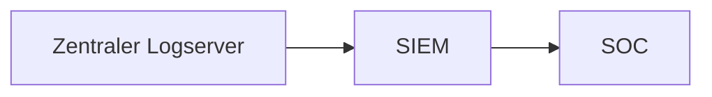

# Zusammenfassung Network Security 22

## ISO/OSI Modell

| Nr | Schicht | Protokoll | Einheiten | Geräte |
|:--:|:-------:|:---------:|:---------:|:--------:|
| 7 | Anwendung | HTTP, FTP, SMTP, DNS | Daten | Gateway, Proxy, L4-7-Switch |
| 6 | Darstellung | AHTTP, FTP, SMTP, DNS | Daten | Gateway, Proxy, L4-7-Switch |
| 5 | Sitzung | HTTP, FTP, SMTP, DNS | Daten | Gateway, Proxy, L4-7-Switch |
| 4 | Transport | TCP, UDP | Segmente, Datagramme | Gateway, Proxy, L4-7-Switch |
| 3 | Vermittlung (Netzwerk) | IP, IPsec, IPX | Pakete | Router, L3 Switch |
| 2 | Sicherung (Verbindung) | IEEE802.3, 802.11 | Frames | Bridge, L2 Switch |
| 1 | Physikalisch | IEEE802.3, 802.11 | Bits | Kabel, Repeater |

## VLAN
Definition: Ein VLAN (Virtual Local Area Network) ist ein logisch abgegrenztes Netzwerk, das unabhängig vom physischen Netzwerk und den darin enthaltenen Geräten existiert. Es wird verwendet, um Netzwerkressourcen und -dienste zu gruppieren, die Kommunikation zu segmentieren und die Sicherheit zu erhöhen.

### VLAN Konventionen

- VLAN 100: ACL "headless" Nutzung für z.B. Fax Geräte
- VLAN 200: CLs QoS Nutzung für z.B. VoIP
- VLAN 300: ACL Nutzung für z.B. Desktops
- VLAN 400: ACL Nutzung für Guest

## LAN 
Definition: Ein LAN (Local Area Network) ist ein Netzwerk, das innerhalb eines Gebäudes oder einer Gruppe von Gebäuden betrieben wird. LANs sind in der Regel auf eine bestimmte Organisation beschränkt und werden von einem einzigen Administrator verwaltet. LANs können über ein physisches Kabel oder drahtlos über Funktechnologien wie WLAN oder Bluetooth verbunden sein.

### Angriffsvektoren LAN
- Schwachstellen: z.B. in Switches, Router, Access Points
- ARP Spoofing: Technik, bei der ein Angreifer eine falsche ARP-Nachricht an ein Netzwerk sendet, um sich zwischen zwei Netzwerkgeräten zu schalten, um Netzwerkverkehr zu manipulieren oder abzufangen.
- Loops: z.B. durch falsche Konfiguration von Switches
- Veraltete Protokolle: z.B. Telnet, FTP, SNMPv1
- Backdoors: z.B. in Firmware

### Absicherung LAN
- VLANs (Unterteilung in verschiedene Netzwerke)
- Hardening (z.B. Switches, Router, Access Points)
- NAC Erweiterung (z.B. für WLAN)
- Broadcast Storms vermeiden (z.B. durch Portfast)
- Segmentierung mit ACLs

## WLAN

### Angriffsvektoren WLAN
- Wardriving: Technik, bei der ein Angreifer ein WLAN-Netzwerk scannen kann, um die SSID und die MAC-Adresse des Access Points zu ermitteln.
- WEP: veraltete Verschlüsselungsmethode, die leicht gebrochen werden kann.
- Fake/Rogue Access Points: Angreifer erstellen ein eigenes WLAN-Netzwerk, um die Verbindung eines Benutzers zu stehlen. (Evil Twin)
- Sniffing: Angreifer können den Datenverkehr eines WLAN-Netzwerks abfangen, um Passwörter, Benutzernamen und andere sensible Daten zu stehlen.

### Absicherung WLAN
- SSID Hiding: SSID verstecken
- WPA3: neueste Verschlüsselungsmethode
- Rogue AP Detection: Erkennung von Fake/Rogue Access Points
- Abschaltung von WPS und UPnP: WPS und UPnP sind nicht sicher und sollten daher deaktiviert werden.

## WAN
Definition: Ein WAN (Wide Area Network) ist ein Netzwerk, das über eine größere geografische Region verteilt ist. WANs können über ein physisches Kabel oder drahtlos über Funktechnologien wie WLAN oder Bluetooth verbunden sein.

### Angriffsvektoren WAN
- SMB: Angreifer können ein SMB-Netzwerk scannen, um die IP-Adresse des Servers zu ermitteln.
- DDoS: Angreifer können eine DDoS-Attacke durchführen, indem sie eine große Anzahl von Geräten mit einem Botnetzwerk infizieren.
- Offene Ports: Angreifer können die Ports eines Servers scannen, um die Dienste zu ermitteln, die auf dem Server ausgeführt werden.

### Absicherung WAN
- Router Hardening: z.B. Firewall, IPS, IDS
- Zonierung (z.B. DMZ)
- Managementzugriff auf Router und Switches beschränken
- DDOS Schutz (z.B. durch Anbieter)

## Firewall
Definition: Eine Firewall ist ein Sicherheitsmechanismus, der zwischen zwei Netzwerken platziert wird, um die Kommunikation zwischen diesen beiden Netzwerken zu kontrollieren. Firewalls können auf verschiedenen Ebenen eingesetzt werden, um die Kommunikation zwischen zwei Netzwerken zu kontrollieren. Sie können auf der Anwendungsebene, der Transportebene, der Vermittlungsebene oder der Sicherungsebene eingesetzt werden.

### Angriffsvektoren Firewall
- Schwachstellen in Firmware
- Regelwerk überfüllt
- Keine Change History
- Keine Review oder Audit
- Logische Fehler

### Absicherung Firewall
- Auditierung des Regelwerks
- Überprüfen z.B. mit NMAP
- Automatisierte Tests
- Updates und Patches

## IDS/IPS

### Angriffsvektoren IDS/IPS
- Überlastung durch zu viele Events
- Bypass Techniken (z.B. durch Paket-Fragmentierung)

### Absicherung IDS/IPS
- Aktuelle Signaturdatenbank
- Zyklische automatisierte Überprüfung
- Verschlüsselte Kommunikation berück­sichtigen

## WEB/WAF

Eine Web Application Firewall (WAF) ist ein Sicherheitsmechanismus, der dazu dient, Web-Anwendungen vor Angriffen zu schützen. Es filtert und blockiert bösartige Anfragen, die versuchen, auf Ihre Anwendung zuzugreifen und sie zu schädigen. (z.B. SQL-Injection, Cross-Site Scripting, etc.)

### ByPass Techniken
- VPN
- URL-Filter oft nicht ausreichend
- DNS über HTTPS
- Portable Apps

### Angriffsvektoren WEB/WAF
(wie beui IDS/IPS)

### Absicherung WEB/WAF
- Whitelistings
- Zusätzlich zu Scans auch manuelle Tests durchführen
- Vergabe an Diensleister sinnvoll

## VPN
VPN (Virtual Private Network) ist ein Netzwerk, das es Nutzern ermöglicht, über ein öffentliches Netzwerk wie das Internet eine sichere und private Verbindung herzustellen. Es bietet eine verschlüsselte Verbindung und ermöglicht es Nutzern, auf entfernte Netzwerke und Ressourcen zuzugreifen, als ob sie an dem lokalen Netzwerk angeschlossen wären.

### Angriffsvektoren VPN
- Alte Parameter
- Nicht ausreichende Schlüssellänge
- Fehlkonfiguration

### Absicherung VPN
- Auditierung der Konfiguration
- Keine Verwendung von alten Protokollen
- Schlüsselverwaltung

## PKI
Definition: Public Key Infrastructure (PKI) ist ein System, das dazu dient, digitale Zertifikate auszustellen, zu verwalten und zu überprüfen

### Angriffsvektoren PKI
- Unsichere Schlüsselverwaltung
- Unsichere Serverkonfiguration
- Technologische Fehler im Allgemeinen

### Absicherung PKI
- Auditierung 1x pro Jahr
  
## SSL Inspection

SSL Inspection(auch HTTPS Inspection) ist eine Technik, bei dem ein Netzwerkgeräte (z.B. Firewall) den verschlüsselten Datenverkehr eines Netzwerks analysiert und nach potenziellen Bedrohungen sucht (z.B. Malware, Phishing, etc. ohne die Verschlüsselung zu unterbrechen).

### Problemstellung SSL Inspection
1. Leistungseinbußen durch zusätzliche Verarbeitung des Datenverkehrs
2. Sicherheitsrisiko: wenn nicht korrekt konfiguriert, kann der Datenverkehr von Angreifern verwendet werden und Rückschlüsse auf die Kommunikation der Nutzer gezogen werden.
3. Datenschutz: wenn z.B. der Inhalt privater Nutzung (z.B. E-Mails) analysiert wird, kann dies zu einem Verstoß gegen die DSGVO führen

## Scanning

- Zurückgreifen auf Dienstleister
- Automatisierung der Scans
- Integration in z.B. SIEM

## Rechtliche Aspekte Scanning
- EU: Dual Use Regelung (09/21)
- § 202a StGB Ausspähen von Daten (Hackerparagraph)
- Tatbestände der virtuellen Sachbeschädigung (§§ 303a-303b StGB)
- Pentests sind zulässig, wenn sie im Rahmen eines Sicherheitskonzeptes durchgeführt werden

## SIEM

SIEM steht für Security Information and Event Management. SIEM ist ein System, das dazu dient, die Sicherheit eines Netzwerks zu überwachen und zu verwalten. Muss compliance-konform sein (z.B. ISO 27001, etc.)

### Zentraler Logserver
- Log Sicherung (z.B. auf externem Server)
- Zugriff auf Logs ohne System Zugriff auf die tatsächlichen Systeme
- Audit Anforderungen erfüllen
- Archivierung der Logs

### SIEM
- 24/7 Überwachung
- Alarmierung bei Bedrohungen
- Regelgesteuerte Reaktionen
- Notfallplanung
- Know-how von Mitarbeitern

### SOC (Security Operations Center) Managed Service
- Entlastung der IT
- Spezialisten auf dem Gebiet
- Prozesse und Methoden
- Technologisches Know-how

## Gesetze und Normen
| Institution | Bezeichnung | Link |
| --- | --- | --- |
|  | ISO 27001 | https://www.iso.org/standard/54543.html |
|  | KRITIS | https://www.itskritis.de/ |
|  | BAFIN | https://www.bafin.de/ |
| | TISAX | https://www.tisax.de/ |
| | DSGVO | https://www.datenschutzkonferenz.de/ |
| | IT Grundschutz | https://www.it-grundschutz.de/ |
| | PCI DSS | https://www.pcisecuritystandards.org/ |
| |HIPAA | https://www.hhs.gov/hipaa/for-professionals/security/laws-regulations/index.html |

## Hardening 
Hardening ist die Prozess der Absicherung von Systemen und Netzwerken

### Switch Hardening
- Aktualisierung der Switch Firmware
- Deaktivierung von unsicheren Protokollen und Diensten (z.B. SNMP, Telnet, etc.)
- Zugriff personalisieren (z.B. nur bestimmte IP-Adressen)
- Monitoring, Protokollierung, Alarmierung und Datensicherung

## DDOS
DDOS steht für Distributed Denial of Service. DDOS ist ein Angriff, bei dem ein Netzwerk mit einer großen Anzahl von Anfragen überlastet wird, sodass es nicht mehr erreichbar ist.

### Absicherung DDOS
- Angemessene Bandbreite
- Obfuskieren der IP-Adressen und interner Netzwerkstruktur
- Verlagern der Last auf externe Dienste

## SDWAN
SDWAN steht für Software Defined Wide Area Network. SDWAN ist ein Netzwerk, das aus mehreren Netzwerken besteht, die über eine zentrale Verwaltungseinheit verwaltet werden.

### Vorteile modernes SDWAN
- Hohe Flexibilität (z.B. Verbindung zu mehreren Cloud Providern)
- Erhöhte Sicherheit (z.B. durch Überwachung und Verschlüsselung)
- Kostenreduzierung (z.B. dadurch, dass keine eigene Netzwerk-Hardware angeschafft werden muss)
- Erhöhte Geschwindigkeit (z.B. durch die Nutzung von mehreren Internetverbindungen und oder Multi-Cloud)

## Cloud Security

### Cloud Security Verantwortlichkeiten
| Daten/Dienst/Anwendung | Verantwortung |
| --- | --- |
| Kunden Daten | Kunde |
| Plattformen, Apps | Kunde |
| Konfiguration von OS, Netzwerk, etc. | Kunde |
| Verschlüsselung | Kunde |
| Compute, Storage, Netzwerk | Cloud Provider |
| Cloud Infrastruktur | Cloud Provider |

### Absicherung Cloud
- Multi-Faktor-Authentifizierung
- Conditional Access: Zugriff nur von bestimmten Geräten und Standorten
- Dokumentation der Cloud Umgebung: z.B. mit Azure Blueprints
- Alarmierung bei Bedrohungen

#### Conditional Access

- MFA
- Benutzer- und Rollenbasierte Zugriffssteuerung
- Endgeräteverwaltung: z.B. nur bestimmte Geräte (MAC-Adressen) erlauben
- Geografische Einschränkung: z.B. Zugriff nur von bestimmten Standorten erlauben

## OSINT
OSINT (Open Source Intelligence) ist eine Art der Ermittlung, die auf offenen, nicht-klassifizierten Informationen beruht, die über das Internet und andere Quellen zugänglich sind. OSINT kann verwendet werden, um ein breites Spektrum an Themen zu erforschen, wobei der Fokus hauptsächlich auf Cyber-Sicherheit und Terrorismus liegt.

### OSINT Schritte
1. Identifizierung der Zielgruppe
2. Erstellen des Angriffsplans
3. Angriff Ausführung
4. Angriff Erkennung und Abwehr

## E-Mail Security

### Angriffsvektoren E-Mail
- Phishing
- Spear Phishing
- Hafnium: Angriff auf Microsoft Exchange Server

### Absicherung E-Mail
- Nutzung von E-Mail Security Lösungen
- Sandboxen

## IOT
IOT steht für Internet of Things. IOT ist ein Netzwerk, das aus vielen Geräten besteht, die über das Internet miteinander verbunden sind.

- Viele Geräte im Einsatz
- Häufig unmanaged

## Operational Technology (OT)

Operational Technology (OT) ist die Technologie, die die mechanischen und physischen Komponenten innerhalb eines Unternehmens, eines Produktionsprozesses oder einer Infrastruktur steuert, überwacht und optimiert. Dazu gehören Maschinen, Geräte, Sensoren, Instrumente und andere Geräte, die dazu beitragen, ein Netzwerk oder System zu errichten und zu verwalten.

### Früher vs Heute
- Früher: abgekoppelte Systeme
- Früher: Glasfaser und Kupferleitungen
- Früher: Betrieb auf speziellen Geräten
- Heute: Cloud, IoT, SDWAN, etc.
- Heute: Drahtlose Verbindungen
- Heute: universelle Geräte

### Absicherung OT
- Asset Management
- Segmentierung
- Isolation von alten Systemen
- SIEM
### OT vs IT

| Kriterium | IT | OT |
| --- | --- | --- |
| Verfügbarkeit | mittel, Verzögerungen tolerierbar | sehr hoch, Verzögerungen nicht tolerierbar |
| Echzeit | nein | ja |
| Lebendauer Komponenten | kurz | lang |
| Updates/Patches | häufig | selten |
| Sicherheitsprüfung/Audit | geplant und beauftragt | gelegentlich |
| Sicherheitsbewusstsein | hoch | niedrig aber steigend |

## NAC
NAC steht für Network Access Control. NAC ist eine Technologie, die es ermöglicht, die Sicherheit von Netzwerken zu verbessern, indem die Geräte, die auf das Netzwerk zugreifen, überprüft werden.

### Zero Trust Ansatz
- Keine Vertrauen in die Netzwerkumgebung
- Verifizierung vor jedem Zugriff
- MFA
- Kontinuierliche Überwachung
- Schutz vor internen Bedrohungen: z.B. durch die Nutzung von SIEM
- Verschlüsselung
- Schutz gegen externe Bedrohungen: z.B. durch die Nutzung von E-Mail Security Lösungen