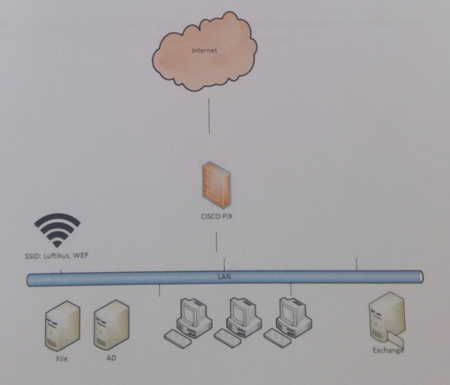

# Beispiel Fragen (aus der Vorlesung und vorherigen Jahrgängen)

## 1. Aufgabe: Netzwerk Größe
Das Netzwerk Ihres neuen Arbeitgebers besteht aus ca. 1000 Systemen, alle befinden sich ein einem großen Class-B Netzwerk 172.1600/16.
Welche Gefahren birgt dies?
Wie sollte das System sicherer aufgebaut sein?
### Lösung
- Das Netzwerk ist mit 65.536 möglichen Adressen zu groß
- Sicherheit kann durch Subnetting verbessert werden
- Unterteilung in Subnetze logischer Größe (z.B. 254 Systeme pro Subnetz)
- Management wird durch Sbbnetting erleichtert, da die Anzahl der Systeme pro Subnetz reduziert wird
- Absicherung der einzelnen Subnetze, z.B. Class C Netzwerke mit 254 Systemen, durch Firewalls

## 2. Aufgabe
Sie untersuchen die drei VPN-Verbindungen Ihrer Firewall zu anderen Partnern.

| VPN-Verbindung | Phase 1 | Phase 2 |
| --- | --- | --- |
| #1 | AES256/SHA1 | AES256/SHA1 |
| #2 | 3DES/MD5 | AES128/SHA-256 |
| #3 | AES256/SHA-256 | AES128/SHA-256 |

Welche der Verbindungen sollten Sie aus Grunden der Sicherheit anpassen und warum)
### Lösung
Phase 1: Authentifizierungsphase (z.B. mit Pre-Shared Key)
Phase 2: Verschlüsselungsphase (z.B. mit AES256)
- VPN #1 ist semi-sicher, da die Verbindung mit AES256 verschlüsselt wird, aber SHA1 sowohl in der Authentifizierungsphase, als auch in der Verschlüsselungsphase, als Hashverfahren genutzt wird. SHA1 gilt nicht mehr als kollisionsfrei und sollte deswegen durch ein stärkeres Verfahren ausgetauscht werden.
- VPN #2 ist unsicher, da die Verbindung mit 3DES verschlüsselt wird. 3DES ist ein veraltetes Verfahren und sollte nicht mehr verwendet werden. MD5 als Hashverfahren ist ebenfalls veraltet und gilt als unsicher.
- VPN #3 ist sicher, da die Verbindung mit AES256 verschlüsselt wird. Auch die Verschlüsselung der Daten ist mit AES128 sicher. SHA-256 gilt heutzutage als kollisionfrei und ist somit ein sicheres Hashverfahren.

VPN Verbindung 1 & 2 sollte aus Sicherheitsgründen angepasst werden. 

## 3. Aufgabe
Sie untersuchen das Firewall-Regelwerk eines mittelstandischen Unternehmens.
Es besteht aus 250 Regeln, eine Struktur ist schwer erkennbar und die damals handelnden Mitarbeiter haben das Unternehmen verlassen. 
Welche Maßnahmen empfehlen Sie?

### Lösung
- Regelwerk sollte strukturiert werden
- Regeln sollten auf Sinnhaftigkeit und Aktualität überprüft werden
- Bei Bedarf sollten neue Regeln erstellt werden
- Bei Bedarf sollten Regeln gelöscht werden
- Die Überarbeitung sollte zudem dokumentiert werden
- Das überarbeitete Regelwerk sollte im Nachhinein durch Tests überprüft werden
- Das Regelwerk sollte zudem regelmäßig überprüft und auditiert werden

## 4. Aufgabe
Welche internationale Norm beschreibt die Einrichtung, Umsetzung, Aufrechterhaltung undfortlaufende Verbesserung eines dokumentierten Informationssicherheits-Managementsystems?

### Lösung
Die internationale Norm, die die Einrichtung, Umsetzung, Aufrechterhaltung und fortlaufende Verbesserung eines dokumentierten Informationssicherheits-Managementsystems beschreibt, ist ISO/IEC 27001.
- Anforderungen an ein Informationssicherheits-Managementsystem
- Schritte zur Einrichtung eines Informationssicherheits-Managementsystems
- Vorschriften zum Betrieb, Überwachung und Verbesserung eines Informationssicherheits-Managementsystems

## 5. Aufgabe
Sie müssen einen Zugriff aus dem Internet für das Warenwirtschaftssystem Ihres Unternehmens ermöglichen.
Das System ist ein Web Service auf Port http/80. Ihre Firewall verfügt über folgende Möglichkeiten:
- Destination NAT mit Firewall Regeln
- Web Application firewall (WAF)
- Client VPN mit MFA
Welches der Optionen ist die sicherste, welches die zweitsicherste und welche ist am unsichersten?
Begründen Sie Ihre Entscheidung.

### Lösung
Die sicherste Option ist eine Client VPN mit MFA. Diese Methode ermöglicht es, Benutzer anhand mehrerer Faktoren zu authentifizieren
Die zweitsicherste Methode ist eine Web Application Firewall (WAF). Diese Methode ermöglicht es, den Zugriff auf das Warenwirtschaftssystem zu filtern und zu kontrollieren indem nur bestimmte Anfragen zugelassen werden.
Die unsicherste Methode ist eine Destination NAT mit Firewall Regeln. Diese Methode ermöglicht es, den Zugriff auf das Warenwirtschaftssystem zu filtern und zu kontrollieren indem nur bestimmte Anfragen zugelassen werden. Die Authentifizierung erfolgt jedoch nicht.

## 6. Aufgabe
Die OT hat im Vergleich zur IT spezifische sicherheitstechnische Herausforderungen. Nennen Sie drei Unterschiede zwischen der IT und der OT.

### Lösung

| IT | OT |
| --- | --- |
| Verwendete Komponenten sind meistens Standard-Produkte | Verwendete Komponenten sind meistens speziell angepasste Produkte |
| Verfügbarkeit ist meistens nicht kritisch | Verfügbarkeit ist meistens kritisch |
| Updates finden häufig statt | Updates finden selten statt |

## 7. Aufgabe
Das BSI veröffentlicht auf deren Webseite ein Kompendium zur Informationssicherheit. Wie heißt dieses? 
Welche zwei Sicherheitsstufen gibt es dort (Neben der Kernabsicherung)?

### Lösung
Das Kompendium heißt "IT-Grundschutzkataloge". Die zwei Sicherheitsstufen sind die Basisabsicherung und die Erweiterte Absicherung.

## 8. Aufgabe
Ausgangslage
Kerngeschaft des familiengeführten Unternehmens ist das Installieren von Lüftungsanlagen in großen
Fabrikationshallem Die komplette IT wird über eine Einmann-Firma realisiert, die das Unternehmen
schon seit 15 Jahren mit IT-Systemen beliefert. Am Firmensitz gibt es einen Raum mit einem 19"-
Schrank. Darin befindet sich eine Cisco Pix Firewall (Baujahr 2010) und mehrere Server, teilweise
virtualisiert. Die WLAN-Lösung ist aus dem Jahr 2015 und arbeitet mit WEP. Ein Exchange-Server
2016 ist als Server vorhanden und über die Firewall zum Internet erreichbar gemacht worden für
Mail und Activesync. Dieses System funktionierte die letzten Jahre ganz gut, aber ist nicht mehr
zeitgemäß. Man dachte schon darüber nach, Systeme in die Cloud zu verlagern. Leider ist dies
aufgrund der mäßigen Bandbreiten und mangels naher Rechenzentren nicht möglich.
Nachdem auf dem Exchange-Server unerklärliche Daten gefunden wurden und Sie von anderen
Firmen darauf hingewiesen wurden, dass von Ihrer Mail-Domäne SPAM versandt wird, stoppt der
Dienstleister den Server. Eine Überprüfung ergibt, dass der Exchange-Server einen Hafnium Vorfall
hatte.
Der Geschaftsführer des Unternehmens hätte gerne ein Sicherheitskonzept. Für eine erste
Diskussionsgrundlage soll ein Entwurf vorbereitet werden.
Grobplan Netzwerk:

### Lösung
Kurzfristige Maßnahmen
- Die verwendete WLAN Verschlüsselung muss mindestens auf WPA2 geändert werden. WEP ist nicht mehr sicher und sollte nicht mehr verwendet werden.
- Die Einmann IT-Firma sollte ausgetauscht werden. Sie ist nicht mehr zeitgemäß und bietet keine Sicherheit. Im Jahr 2015 hätte WEP nicht mehr verwendet werden dürfen. In Betracht käme eine Firma, die sich auf IT-Sicherheit spezialisiert hat und mit gängigen Systemen arbeitet.
- Eine Unterteilung des Netzwerkes in ein LAN und ein DMZ Netzwerk ist sinnvoll. Das LAN Netzwerk sollte nur für die Kommunikation zwischen den internen Systemen verwendet werden. Das DMZ Netzwerk sollte nur für die Kommunikation mit dem Internet verwendet werden.
- Der Exchange Server sollte in ein separates Subnetz platziert werden und nur den Exchange Verkehr zulassen.

Langfristige Maßnahmen
- Der Exchange-Server sollte durch einen Exchange-Server in der Cloud ersetzt werden. Ein Exchange Server hat keinen hohen Verbrauch an Bandbreite und kann daher selbst bei geringer Bandbreite problemlos in der Cloud betrieben werden.
- Austausch der Firewall durch eine Firewall mit aktueller Software. Die Cisco Pix Firewall ist nicht mehr zeitgemäß und bietet keine Sicherheit mehr.
- Langfristig sollte darauf geachtet werden, dass zu dem bereits vorhandenen Server Systeme weitere Server hinzukommen. Dies ist wichtig, wenn ein redundanter Betrieb gewünscht ist. Ein redundanter Betrieb ist wichtig, wenn ein Ausfall des Servers nicht akzeptabel ist.
- Zusätzlich sollte für die Systeme eine Backup-Lösung eingerichtet werden.
- Ersetzen der Cisco Pix Firewall durch eine Firewall mit aktueller Software. Beispielsweise durch eine Next Generation Firewall, die eine Kombination aus Application Level Gateway Firewall, Intrusion Detection System und Intrusion Prevention System bietet. Sie überwacht den Netzwerkverkehr auf Protokollebene und kann unerwünschten Verkehr verhindern.
